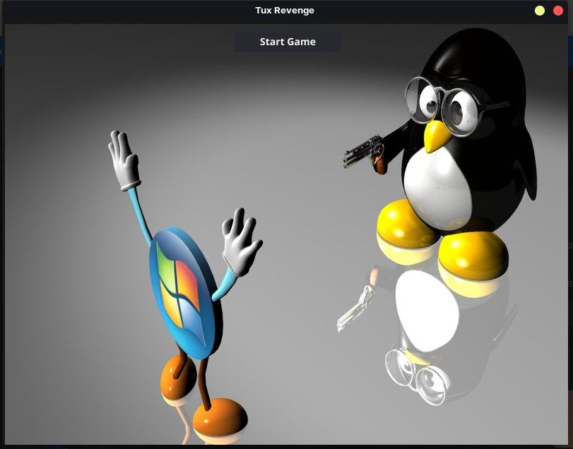
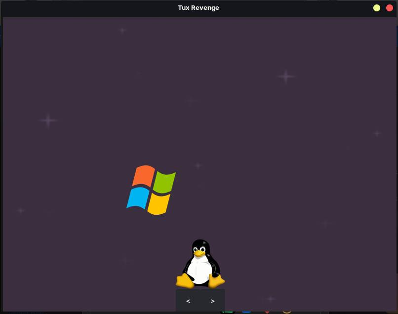

# TuxGame

TuxGame is an exciting and unique gaming experience that pits Tux, the beloved Linux mascot, against the Windows operating system. This project was born out of a desire to showcase the incredible potential of Go in concurrent programming.

## Tabla de Contenidos

- [Instalation](#instalation)
- [Examples](#examples)
- [Contribución](#contribución)
- [Contact](#contact)

## Instalation
Before you can run this project, it's essential to ensure that FYNE is correctly installed and configured on your computer. If you haven't already, please follow the installation instructions in the [Get Started Guide](https://developer.fyne.io/started/) provided by FYNE.

Run `cd CONCURRENT-GAME-GO-FYNE` to navigate to the folder where the project is ubicated.

Run `go mod tidy` to install all the dependencies.

Run `go run .` to exec the project

## Examples

### Game Menu

### In-game

## Contribución

I value your input and contributions. If you have ideas, improvements, or features to add, please don't hesitate to get involved. Together, we can make TuxGame even better.

## Contact

For questions, suggestions, or collaboration opportunities, feel free to reach me:

- Email: hirammendez000@gmail.com
- GitHub: [HiramZednem](https://github.com/HiramZednem)

